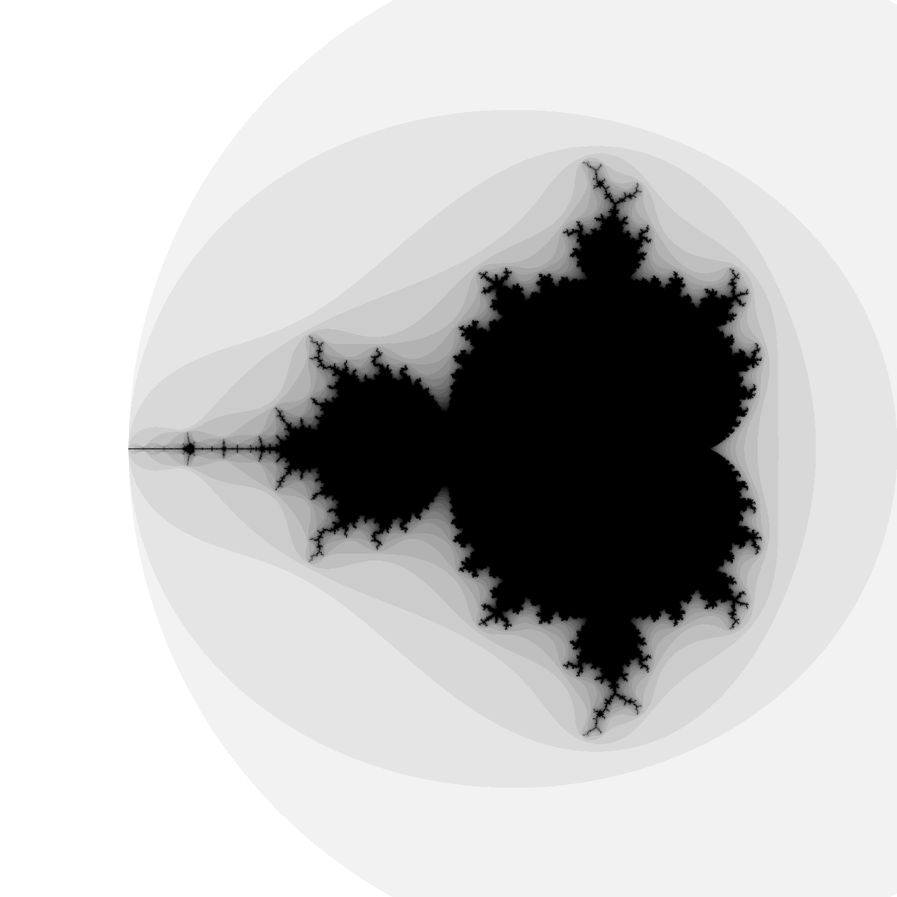

<p align="center">
  
</p>

<h1 align="center">FractalDive</h1>

<p align="center">
  A high-performance, interactive explorer for Mandelbrot and Julia sets built in Julia.
</p>

<p align="center">
  
  
</p>

---

## Features
- **Smooth Navigation:** Real-time zooming (scroll) and panning (drag) across the complex plane.
- **Dual Mode:** Explore the Mandelbrot set or switch to Julia set mode with real-time parameter tuning.
- **Performance Optimized:** 
    - Multi-threaded CPU rendering for fast updates.
    - Optional **CUDA GPU acceleration** for near-instant rendering on supported hardware.
    - **Interruptible rendering:** The UI stays responsive even during heavy calculations.
    - **Low-res preview:** Maintains high FPS during movement by rendering at lower resolution.
- **Infinite Detail:**
    - **High Precision Mode:** Uses `BigFloat` arithmetic to zoom far beyond the limits of standard 64-bit floats.
    - **Auto-Iterations:** Dynamically adjusts calculation depth as you zoom deeper.
- **Visuals:** Multiple color palettes and smooth coloring algorithms.
- **Export:** Save high-resolution PNGs of your discoveries.

## Getting Started

### Prerequisites
- [Julia](https://julialang.org/downloads/) (1.9 or later recommended).
- Optional: NVIDIA GPU for CUDA acceleration.

### Setup
Clone the repository and install the dependencies:
```bash
julia --project=. -e 'using Pkg; Pkg.instantiate()'
```

### Running the App
To leverage all CPU cores, start Julia with multiple threads:
```bash
# -t auto uses all available cores
julia --project=. -t auto src/FractalDive.jl
```

## How to Navigate
- **Zoom:** Use the **Scroll Wheel** (zooms toward your cursor).
- **Pan:** **Click and Drag** the fractal.
- **Reset:** Click "Reset View" to return to the starting coordinates.
- **Julia Mode:** Toggle "Julia Set Mode" and use the sliders to morph the shape.
